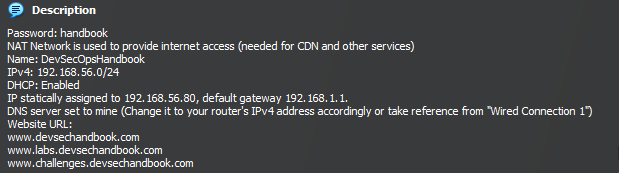

# What is Dev-Sec-Ops-Handbook?
This handbook is a web application designed to teach users about **SQL Injections and JavaScript Cross Site Scripting**. The handbook contains **both theoretical and practical** learning materials, and contains **over 30 different challenges** for users to hone their skills with.

## Installation
There are two methods of installation; The first method utilises XAMPP Control Panel while the second method is a "plug-and-play" Virtual Machine.

### Method one: XAMPP Control Panel
<iframe width="560" height="315" src="https://www.youtube.com/embed/-pdpMZr-t9s" title="YouTube video player" frameborder="0" allow="accelerometer; autoplay; clipboard-write; encrypted-media; gyroscope; picture-in-picture; web-share" allowfullscreen></iframe>
1. Download XAMPP Control Panel.
2. [Download all necessary files here.](https://github.com/TragicLoveStory/DevSecOpsHandbook/releases/download/v0.1.0/Handbook_Files.zip)
3. Move the folders 'majorProject' and 'hands-on' to your XAMPP's **htdocs folder**.
4. Open the apache config file 'httpd.conf'. Search for the string 'xampp/htdocs' and **uncomment the line** ```# AllowOverride All```. More information can be found in the link below:
	- https://stackoverflow.com/questions/24472349/htaccess-doesnt-work-on-xampp-windows-7
5. Turn on MySQL and Apache in XAMPP. Navigate to phpmyadmin by typing 'localhost/phpmyadmin' in your browser's URL.
6. Create 3 databases; **handbook**,**handson**, and **challenges**.
7. Create the user **wukong**. Set the host name to **localhost** and the password to **heaven**.
	- Give the user **wukong** access to **only the database 'handbook'**. This user **should not** have access to any other databases.
8. Create the user **nezha**. Set the host name to **localhost** and the password to **demon**.
	- Give the user **nezha** access to **only the databases 'handson' and 'challenges'**. This user **should not** have access to any other databases.
9. Lastly, import all the data from the .sql files provided. Import the files 'handbook.sql', 'handson.sql', and 'challenges.sq' accordingly based on their respective databases.

### Method two: Virtual Machine
<iframe width="560" height="315" src="https://www.youtube.com/embed/Civ9bpe-zKc" title="YouTube video player" frameborder="0" allow="accelerometer; autoplay; clipboard-write; encrypted-media; gyroscope; picture-in-picture; web-share" allowfullscreen></iframe>
- [Download the virtual machine here (Only for TP students and staff!)](temp)
- Import the VM using Oracle Virtualbox.
	- **Ensure 'Mac Address Policy' is set to 'Include only NAT network adapter MAC addresses'**
- Create a NAT Network called 'DevSecOpsHandbook'. Set the IPv4-Prefix to '192.168.56.0/24' and enable DHCP.  

- Start up the machine! **Password for the Ubuntu Virtual Machine is 'handbook'**. To access the web application, the website URLs are:
	- http://www.devsechandbook.com
	- http://labs.devsechandbook.com 
	- http://challenges.devsechandbook.com
- If you are unable to connect to the internet, change the DNS servers accordingly 
	- The DNS server for the virtual machine should be **your main computer's internet connection's default gateway**  

- **To access the Handbook web application using another virtual machine:**
	1. Ensure all virtual machines being used are connected to the NAT Network 'DevSecOpsHandbook'
	2. Add 6 different entries to the /etc/hosts file (or it's equivalent for non Debian linux distributions) as shown in the picture below (devsechandbook.com, labs.devsechandbook.com, challenges.devsechandbook.com):  
	
 
